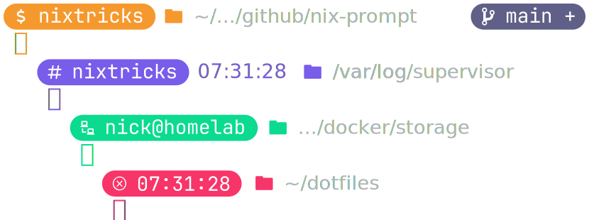

# `>_` nix-prompt

**A clean, modular Bash prompt with just the right amount of features.**

Designed to be **readable**, **hackable**, and **safe** to source in `.bashrc`.

No framework. No dependencies. No magic.



> **Note on the name**:
> `nix-prompt` is not something specific to NixOS.
> The name comes from my channel, *NIX tricks*, where "nix" refers to Unix-like systems in general. This is a Bash prompt and works on any Linux or Unix-like system.


## Features

### 🛠️ Modular segments

- Identity (user / host / context)
- Timestamp
- Path
- Git status
- Prompt symbol


### 🎨 Modern aesthetics

- Truecolor support
- Nerd Font icons


### 👀 Context-aware

- Root vs user
- SSH sessions
- Last error state
- Git integration


## Requirements

- Bash ≥ 4
- Git (optional, for git segment)
- Nerd Font (recommended, for glyphs and rounded badges)

The preview above uses [JetBrainsMono Nerd Font](https://github.com/ryanoasis/nerd-fonts/releases/download/v3.4.0/JetBrainsMono.zip).

Check out more NF goodies at [nerdfonts.com](https://www.nerdfonts.com/font-downloads).


## Installation

Before anything else, make sure your terminal uses a Nerd Font instead of a regular (non-patched) font. The glyphs are used to create those rounded corner badges and display most of the icons. Alternatively, the script can be configured to use fallbacks — check the [Configuration](#configuration) section a little lower.

### Automatic method

Just copy and paste this one-liner:

```bash
curl -sS https://raw.githubusercontent.com/nix-tricks/nix-prompt/refs/heads/main/scripts/install.sh | bash
```

This is what the install script does:
- Downloads the script to your home directory as `.nixprompt`
- Creates a backup of any existing file with that name
- Sources the script in `.bashrc` (if not already sourced)

### Manual method

1. Download the script `scripts/nixprompt.sh` to your home directory as a file named `.nixprompt`
2. Source it in `.bashrc` by adding something like: `[ -f ~/.nixprompt ] && source ~/.nixprompt`
3. Restart the terminal session to see the changes
4. Repeat for the root user and other users (local & remote)


## Configuration

**All configuration is centralized in the `config()` function.**

The first function in the script is `config()` and it can be modified to add, remove or reorder prompt segments, change the colors, toggle prompt features or configure other options related to git or the shell.

### 1. Segments

**Segments are rendered in order**

```bash
segments=(identity timestamp path git prompt)
```

The `segments` variable defines an array of segments that are to be rendered in the specified order. A render function corresponds to each segment (e.g. `render_identity` for the `identity` segment) and each renderer is called by the `init()` function.

**Some segments are evaluated dynamically on each prompt redraw**

```bash
dynamics=(identity git)
```

The `dynamics` variable is for segments with renderers that need to be evaluated every time the prompt is rendered (e.g. the `identity` and `git` segments). Dynamic renderers cannot rely on Bash's backslash-escaped prompt expansions (such as `\w` or `\h`), since they are evaluated via command substitution.

### 2. Colors

There are three color variables that can be customized using hex values:

```bash
color_primary="#f5992e"   # accent for regular users (e.g. identity)
color_secondary="#785cea" # is the same as the above but for root
color_neutral="#5f5f87"   # is used as a faded alternative (e.g. git)
```

The global color is automatically selected depending on whether the shell is running as root.

### 3. Features

There are three variables that can be used to toggle some of the features:

```bash
use_colors=true # can be turned off to use the default foreground color
use_icons=true  # can be turned off to replace NF glyphs with symbols
use_badges=true # can be turned off to remove the segment backgrounds
```

### 4. Options

There are three environment variables related to prompt configuration:

```bash
PROMPT_DIRTRIM=2 # sets the number of trailing directory components
GIT_PS1_SHOWUNTRACKEDFILES=1 # controls the untracked files indicator
GIT_PS1_SHOWDIRTYSTATE=1 # controls the dirty state indicator display
```


---

**Note:** This prompt script modifies your `PS1`, `PS2`, and `PROMPT_COMMAND` environment variables. To revert to your original prompt, simply comment out or remove the source line from your .bashrc.
